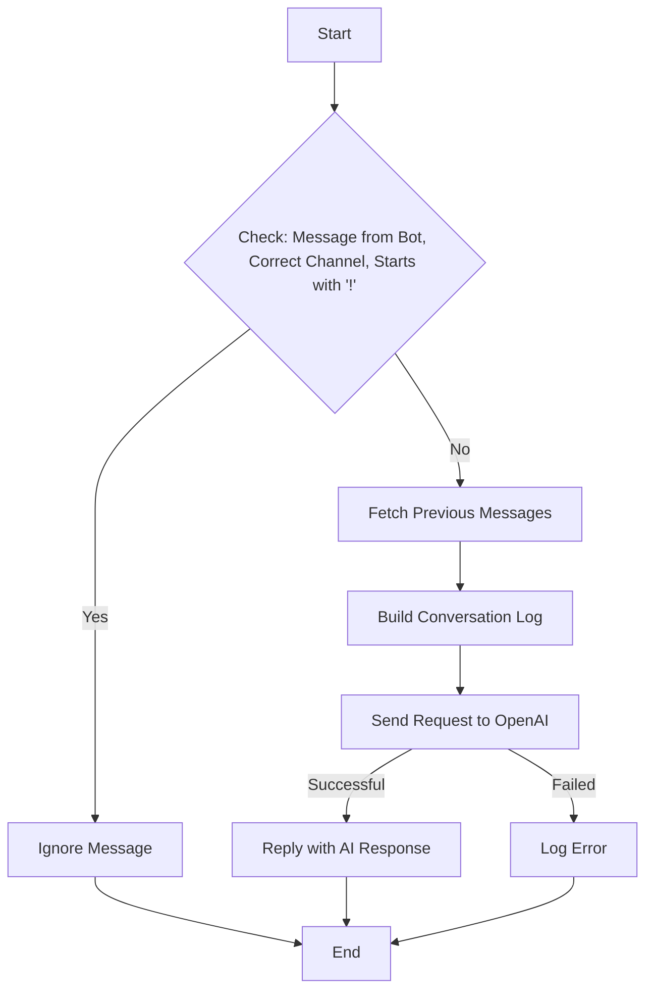

# paradox-gpt-discord-bot
This JavaScript script creates a bot for Discord using the discord.js library and integrates it with OpenAI's GPT-4 model using OpenAI's Node.js library. The bot listens to incoming messages in a specific Discord channel, carries a conversation with users using OpenAI's model, and responds back in the same channel.

# Prerequisites 

1. **Node.js**: This project is based on Node.js. Make sure to install Node.js and npm.
2. **Discord Developer Account**: You will need a Discord developer account to create and manage bots.
3. **OpenAI API Key**: You need an API key from OpenAI to use the GPT-4 model.
4. **Required Dependencies**: The required dependencies are `discord.js`, `dotenv`, and `openai`.
5. The bot uses environment variables stored in the `.env` file for configuration. These are:

- `TOKEN`: The Discord bot token. This is unique to each bot, and is used to log the bot into Discord.
- `API_KEY`: The OpenAI API key. This is used to authenticate requests to the OpenAI API.
- `CHANNEL_ID`: The ID of the channel in which the bot will listen for and send messages.

# How to Run

1. Install all the dependencies mentioned in the `package.json` file using the command `npm install`.
2. Make sure the `.env` file has the correct environment variables defined.
3. Run the bot by using the command `node index.js`.

# Step-by-Step

**1. Setup and Configuration:**

- `dotenv/config`: This package is used to load environment variables from a `.env` file into `process.env`.
- The `discord.js` library is used to interact with the Discord API.
- The `openai` library is used to interact with the OpenAI API.
- The bot is created with certain intents (permissions it needs to function). These intents include the ability to view channels, send messages, and view message content.
- The OpenAI API is configured with the API key obtained from OpenAI.

**2. Event Handling:**

- The `client.on('ready')` event fires when the Discord bot is online and ready to start working.
- The `client.on('messageCreate')` event is triggered whenever a new message is created in a channel the bot can see.

**3. Message Processing and OpenAI Integration:**

- The bot checks every message. If the message is from a bot, from a channel other than the one specified, or starts with '!', the bot ignores the message.
- When a valid message is received, the bot initiates a conversation log and fetches the last 15 messages from the channel, adding each to the conversation log.
- The bot then creates a chat completion using OpenAI's API, passing in the conversation log. This generates a message from the GPT-4 model based on the conversation so far.
- The generated message is then sent as a reply to the user's message.

**4. Exception Handling:**

- The entire message processing is wrapped in a try-catch block. Any errors caught during the process are logged to the console.

**5. Bot Login:**

- The bot logs into Discord using the token from the environment variable.
